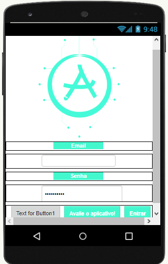
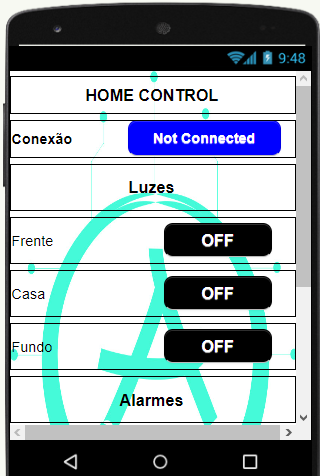
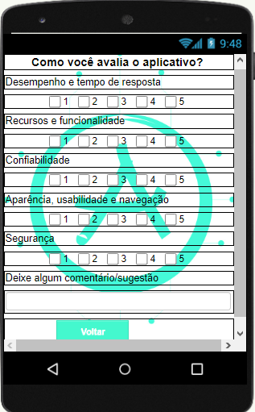

API 1º SEMESTRE - 2019-2

<h1>Apuri</h1>
<h2>Visão do projeto</h2>

Desafio proposto pelo parceiro acadêmico: FATEC Prof. Jessen Vidal - Faculdade de Tecnologia de São José dos Campos - "O projeto "Apuri" foi uma iniciativa desenvolvida no âmbito acadêmico com o propósito de abordar questões cotidianas por meio de soluções inovadoras. O grupo se empenhou em criar um sistema de segurança residencial integrado a dispositivos móveis, utilizando Arduino e uma combinação de App Inventor da Google e Firebase.

O foco central do projeto Apuri foi conceber um sistema de segurança residencial versátil, oferecendo aos usuários a capacidade de controlar dispositivos domésticos pelo celular. Isso incluiu a habilidade de ligar e desligar luzes em locais específicos e receber notificações instantâneas caso sensores de presença detectassem qualquer movimento suspeito.

Essa abordagem permitiu não apenas a automação residencial, mas também a criação de um ambiente seguro e adaptável, onde os residentes podem gerenciar a iluminação e monitorar potenciais intrusões remotamente, garantindo maior tranquilidade e controle sobre a segurança de suas casas."

<h2>Tecnologias adotadas </h2>

  
  

  

###

<h3>
Firebase
</h3>

Usar o Firebase em um projeto pequeno oferece uma plataforma pronta para armazenar dados e oferecer recursos de autenticação, facilitando o desenvolvimento e a escalabilidade do aplicativo.

<h3>
Arduino
</h3>

O Arduino é ideal para projetos pequenos devido à sua versatilidade e facilidade de prototipagem, permitindo integração simples com o App Inventor. Sua flexibilidade no controle de sensores e atuadores viabiliza soluções customizadas, enquanto o App Inventor simplifica a criação de interfaces intuitivas para interação móvel, unindo eficiência e acessibilidade no desenvolvimento do projeto.

<h3>
App Inventor
</h3>

O uso do App Inventor em vez do Kodular pode ser preferencial por sua interface mais simplificada e acessível, especialmente para iniciantes. Sua curva de aprendizado amigável e a facilidade na criação de aplicativos móveis básicos podem tornar o desenvolvimento mais rápido e intuitivo, sendo ideal para projetos de pequeno porte com foco na funcionalidade essencial e na integração com hardware como o Arduino.

<h2>Contribuições pessoais</h2>

No projeto, minha contribuição centralizou-se na criação das interfaces do aplicativo para celular, utilizando o App Inventor. Desenvolvi as telas que permitiam o controle remoto das funções de segurança residencial propostas, garantindo uma experiência intuitiva e acessível para os usuários. Esta participação foi crucial para viabilizar a interação entre o usuário e o sistema de segurança, agregando praticidade e funcionalidade ao projeto.

<h3>Tela inicial</h3>

A tela de home com as principais opções de controle é importante para fornecer aos usuários uma visão geral do estado dos sensores e permitir que eles executem ações rapidamente.

    
Ver mais

    

<h3>Tela Home</h3>

A tela de home com as principais opções de controle é importante para fornecer aos usuários uma visão geral do estado dos sensores e permitir que eles executem ações rapidamente.

    
Ver mais

    

<h3>Tela Avaliação</h3>

A tela de avaliação do app é importante para coletar feedback dos usuários e melhorar o aplicativo.

    
Ver mais

    

<h2>Aprendizados efetivos</h2>
<h3>Hard skills desenvolvidas</h3>
<h4>Firebase</h4>
O Firebase é uma plataforma de backend como serviço (BaaS) que fornece uma variedade de recursos para desenvolvedores de aplicativos móveis e web. Ele inclui armazenamento em nuvem, autenticação, análise, notificações push e muito mais.

A importância do desenvolvimento de habilidades com o Firebase é que ele permite que desenvolvedores criem aplicativos mais rapidamente e com menos esforço. O Firebase fornece uma base sólida para aplicativos, incluindo autenticação, armazenamento e notificações. Isso libera os desenvolvedores para se concentrarem na criação de funcionalidades e experiências únicas para seus usuários.

<h4>App Inventor</h4>

O App Inventor é uma ferramenta de desenvolvimento de aplicativos móveis que permite criar aplicativos sem codificação. Ele usa um editor visual para arrastar e soltar blocos de código, o que torna o desenvolvimento de aplicativos acessíveis a pessoas de todos os níveis de experiência.

A importância do desenvolvimento de habilidades com o App Inventor é que ele permite que qualquer pessoa crie aplicativos móveis. O App Inventor é uma ferramenta poderosa que pode ser usada para criar aplicativos simples ou complexos. É uma ótima maneira de aprender sobre desenvolvimento de aplicativos e criar aplicativos para uso pessoal ou profissional.

<h3>
Soft Skills
</h3>
<h4>Resolução de problemas</h4>

A resolução de problemas é uma habilidade complexa que envolve várias etapas, como identificação do problema, coleta de informações, geração de soluções e implementação da solução escolhida. É importante desenvolver essa habilidade para que você possa identificar e resolver problemas de forma eficaz.

<h4>Comunicação eficaz</h4>

A comunicação eficaz é uma habilidade essencial para qualquer profissional, independentemente da área de atuação. No primeiro semestre da faculdade, é importante desenvolver a capacidade de se comunicar de forma clara, concisa e eficaz, tanto por escrito quanto oralmente.
