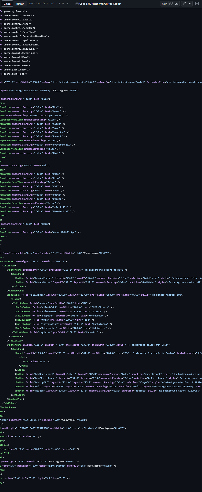

API 1º SEMESTRE - 2019-2

<h1>TECSUS-DDC</h1>
<h2>Visão do projeto</h2>

A TecSUS realiza a gestão de contas de utilidades (água e energia) dos seus clientes. Todos os meses milhares de contas devem ser digitadas manualmente no sistema para a realização de análises de contratos e análises de consumo. Desta forma, para facilitar a digitação das contas precisamos de um sistema que permita o cadastro de cada conta de forma rápida e ágil.

<h2>Tecnologias adotadas </h2>

  
  
  

<h3>
Java e JavaFx
</h3>

Java e JavaFX são duas tecnologias complementares que podem ser usadas para desenvolver projetos de software de alta qualidade. Java é uma linguagem de programação robusta e versátil que pode ser usada para criar uma ampla gama de aplicações, desde sistemas de back-end até aplicações de front-end. JavaFX é uma biblioteca de componentes visuais que permite aos desenvolvedores criar interfaces gráficas de usuário (GUI) atraentes e responsivas.

<h3>
PostgreSql
</h3>

PostgreSQL é um banco de dados relacional de código aberto e gratuito que oferece uma ampla gama de recursos e benefícios. É uma escolha popular para desenvolvedores e empresas de todos os tamanhos, pois é escalável, seguro e extensível.

Aplicações

PostgreSQL pode ser usado para uma ampla gama de aplicações, incluindo aplicações web, aplicações de negócios e aplicações científicas.

<h2>Contribuições pessoais</h2>

As contribuições que fiz a este projeto foram significativas e contribuíram para o seu sucesso. As telas que desenvolvi são fáceis de usar e fornecem informações úteis aos usuários e facilitam a sua navegação pelo sistema

<h3>Tela de cadastro de conta de água</h3>

Desenvolvi a tela de cadastro de conta de água, que permite aos usuários inserir informações sobre suas contas de água, como o número da conta, o consumo de água, a data da leitura e o valor da conta. A tela foi projetada para ser fácil de usar e intuitiva, e inclui recursos como validação de dados e campos obrigatórios para garantir que as informações inseridas sejam corretas. 

    
Ver mais

    

<h3>Tela de cadastro de conta de luz</h3>

Desenvolvi a tela de cadastro de conta de luz, que é semelhante à tela de cadastro de conta de água. No entanto, a tela inclui campos específicos para informações sobre contas de luz, como o número da conta, o consumo de energia, a data da leitura e o valor da conta. 

    
Ver mais

    

<h3>Tela home</h3>

Desenvolvi a tela de home, que fornece uma visão geral das contas de água e luz de um usuário assim como viabiliza a navegação pelo sistema

    
Ver mais

    

<h2>Aprendizados efetivos</h2>
<h3>Hard skills desenvolvidas</h3>
<h4>JavaFX</h4>

JavaFX é uma biblioteca de componentes visuais que permite aos desenvolvedores criar interfaces gráficas de usuário (GUI) atraentes e responsivas. No projeto, usei JavaFX para desenvolver as telas de cadastro de conta de água, conta de luz e dashboard. O processo de desenvolvimento das telas me ajudou a aprender os fundamentos de JavaFX, incluindo como criar componentes, gerenciar eventos e aplicar estilos.

<h4>PostgreSQL</h4>

PostgreSQL é um sistema de gerenciamento de banco de dados relacional (RDBMS) de código aberto e gratuito. No projeto, usei PostgreSQL para armazenar os dados das contas de água e luz. O processo de configuração e uso do PostgreSQL me ajudou a aprender os fundamentos de bancos de dados relacionais, incluindo como criar tabelas, inserir dados e realizar consultas.
<h4>Modelagem de bancos de dados</h4>

A modelagem de bancos de dados é o processo de projetar um banco de dados para atender às necessidades de um aplicativo. No projeto, usei a modelagem de bancos de dados para projetar o esquema do banco de dados PostgreSQL. O processo de modelagem me ajudou a entender os conceitos básicos de modelagem de dados, incluindo o relacionamento entre tabelas e a normalização de dados.

<h3>
Soft Skills
</h3>
<h4>Resiliência</h4>

A resiliência é a capacidade de se recuperar de adversidades. No projeto, tive que lidar com a saída de membros do grupo, o que atrasou o cronograma e aumentou a carga de trabalho. No entanto, fui capaz de me adaptar a essas mudanças e continuar trabalhando para concluir o projeto.

<h4>Adaptabilidade</h4>

A adaptabilidade é a capacidade de se ajustar a mudanças. No projeto, tive que aprender novas tecnologias e métodos de trabalho rapidamente. Também tive que aprender a trabalhar com membros do grupo que tinham diferentes estilos de trabalho.
