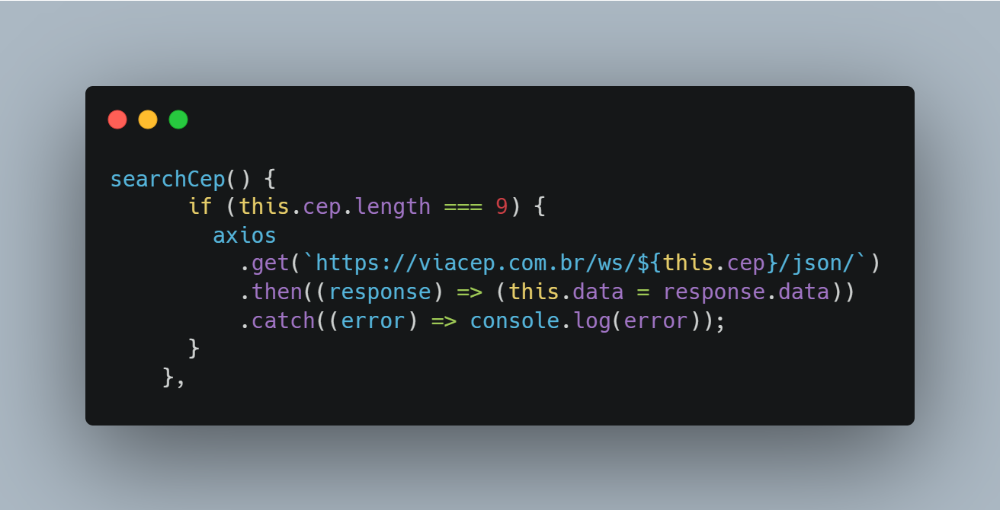
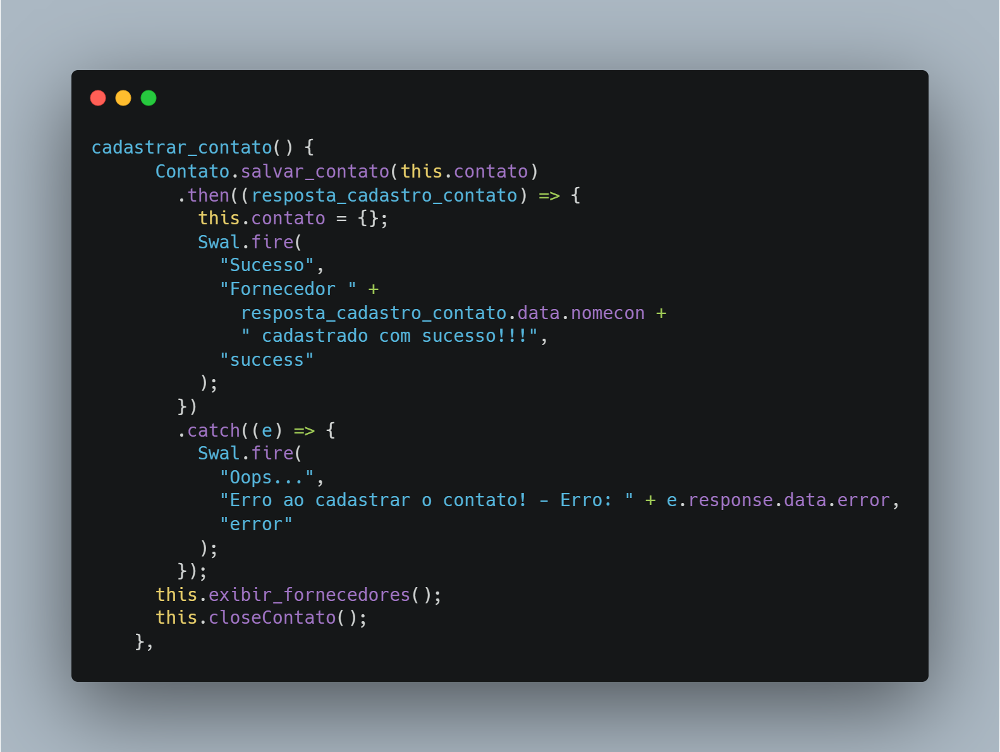
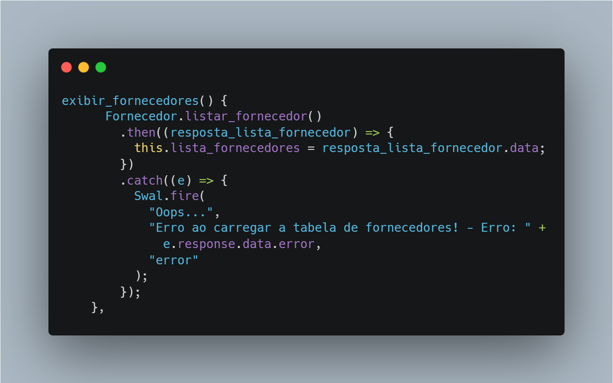

Reade-me Repositório metodologia de pesquisa cientifica

API 4º SEMESTRE - 2021-2

Agend House

<a href="https://github.com/API-4-SEMESTRE/PROJETO-API">
Link para o projeto
</a>

<h2>Visão do projeto</h2>

Desafio proposto pela Oracle Corporation - "No escritório de São Paulo, temos um espaço de inovação aberta chamado Casa Oracle, que é um local para realização de eventos internos/externos, workshops e palestras. Dentro do contexto das restrições sanitárias, nosso desafio é criar uma plataforma para o gerenciamento da utilização do espaço, onde nossos colaboradores poderão fazer a solicitação de agendamento, definindo os convidados e recursos necessários para o evento."

<h2>Tecnologias adotadas </h2>

<h3>
Vue
</h3>

Para o front-end da aplicação escolhemos usar o framework Vue, a escolha foi feita pela praticidade na hora de criarmos e organizar nosso front, é uma tecnologia bem performatica e que possui bibliotecas como o vuetify que nos ajudam a criar telas bonitas, além de ter uma documentação intuitiva e ser de fácil aprendizado

<h3>
Spring
</h3>

Para o backend escolhemos o Spring framework, o motivo da escolha foi feita pois precisávamos de uma ferramenta que agilizasse nosso tempo de desenvolvimento deixando com que o time se preocupasse mais com a lógica da aplicação e menos com questões de configuração de ambiente

<h2>Contribuições pessoais</h2>

Neste projeto eu atuei como Desenvolvedor Frontend, onde por sugestão de um membro da equipe com mais experiência optamos em utilizar o framework Vue.js

<h3>Método de busca de CEP</h3>

A inclusão do método de busca de CEP no meu projeto foi fundamental para aprimorar a experiência do usuário, simplificando e agilizando a inserção de informações. Essa funcionalidade não apenas otimizou a interação, mas também contribuiu para a precisão dos dados cadastrados, garantindo a entrega eficiente de serviços ou produtos ao cliente. Além disso, a integração de um buscador de CEP fortaleceu a confiabilidade do sistema, proporcionando informações exatas e atualizadas.

    
Ver mais

    

<h3>Método de cadastrar contato</h3>

A criação do método de salvar contatos no projeto foi fundamental, proporcionando aos usuários a conveniência de armazenar informações importantes de maneira rápida e eficiente. Essa funcionalidade promoveu a organização pessoal, permitindo que os usuários acessassem facilmente seus contatos, fortalecendo assim a usabilidade da aplicação.

    
Ver mais

    

<h3>Método de exibir fornecedores</h3>

A implementação do método de listagem de fornecedores foi empregada para facilitar a finalização do cadastro, proporcionando uma seleção mais eficiente e precisa durante o processo. Essa abordagem agilizou a identificação de fornecedores, otimizando a conclusão do cadastro e contribuindo para uma gestão mais eficaz das parcerias comerciais.

    
Ver mais

    

<h2>Aprendizados efetivos</h2>
<h3>Hard skills desenvolvidas</h3>
<h4>Javascript + Vue.js</h4>
Ao ingressar no projeto de Vue.js, obtive valiosos aprendizados introdutórios que marcaram minha entrada no universo do frontend. Explorar esse framework proporcionou insights cruciais sobre o desenvolvimento de interfaces interativas e responsivas. A compreensão dos conceitos de componentização e reatividade ampliou minha perspectiva, permitindo-me criar interfaces dinâmicas de maneira mais eficiente. A imersão nesse ecossistema também me apresentou a outras ferramentas essenciais do frontend, abrindo portas para uma jornada de descobertas e aprimoramento contínuo nesse campo do desenvolvimento web.
<h4>Git e Github</h4> 
Ao dar os primeiros passos com Git e GitHub, percebi o quão prático é esse mundo do controle de versão. Pegar o jeito dos comandos básicos do Git e entender como o GitHub facilita a colaboração e o armazenamento de código trouxe mais agilidade ao trabalho em equipe. Essa experiência foi essencial para minha evolução como desenvolvedor, me dando as ferramentas necessárias para gerenciar código de forma eficiente e me envolver em projetos de código aberto.
<h4>Scrum</h4>
Integrar-me a um time Scrum como desenvolvedor foi uma imersão prática no dinâmico método ágil. Com reuniões diárias, sprints e revisões, compreendi a importância da colaboração e da flexibilidade no desenvolvimento de software. Participar ativamente das cerimônias do Scrum proporcionou uma visão holística do processo, enquanto a constante comunicação com a equipe fortaleceu a sinergia e a eficiência na entrega de soluções. Essa experiência não apenas refinou minhas habilidades técnicas, mas também aprimorou minha capacidade de adaptação em ambientes de trabalho ágeis.

<h3>
Soft Skills
</h3>
<h4>
Comunicação
</h4>

- Como desenvolvedor frontend em um time Scrum, percebo a importância crucial da comunicação. Essa dinâmica clara é essencial para entender os requisitos do cliente e colaborar efetivamente com os colegas de equipe, garantindo uma entrega de software coesa e eficiente.

<h3>Trabalho em equipe</h3>

- Como desenvolvedor frontend, valorizo imensamente o trabalho em equipe. Colaborar de forma efetiva com colegas é essencial para trocar ideias, superar desafios e garantir uma abordagem unificada no desenvolvimento de software, resultando em soluções mais robustas e satisfatórias para nossos clientes.