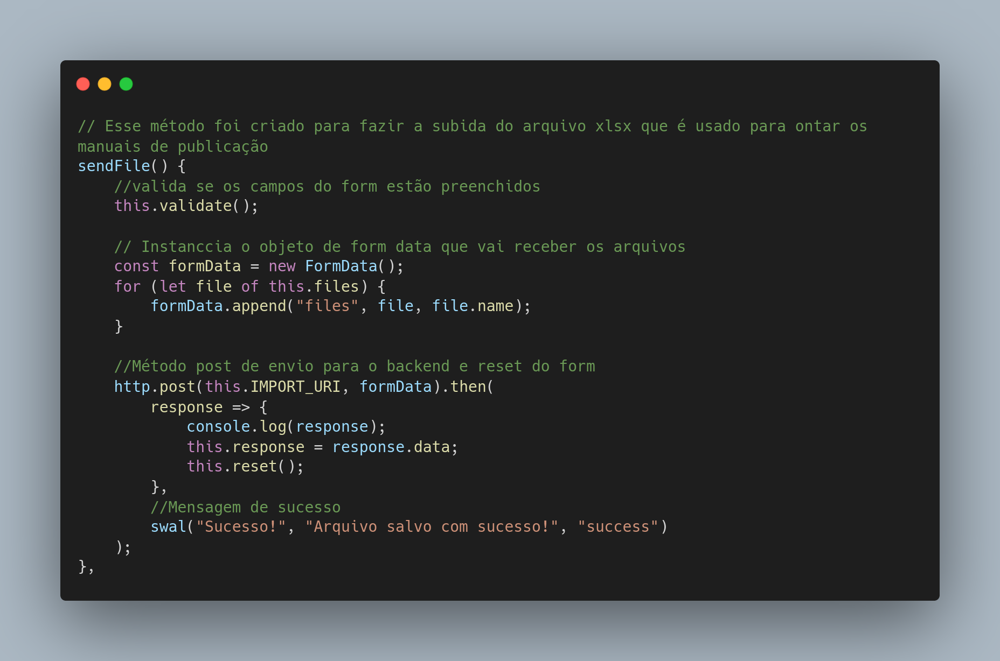

Reade-me Repositório metodologia de pesquisa cientifica

API 3º SEMESTRE - 2021-1

MOM - Management of Operational Manuals

<a href="https://github.com/API-FATEC/API_3sem_2021-01">
Link para o projeto
</a>

<h2>Visão do projeto</h2>

Projeto proposto pelo Time de Publicação Operacional da Embraer, responsáveis por emitir, aprovar e revisar os manuais operacionais de aviação, destinados a pilotos, tripulação, despatcher de aeronaves e provedores de treinamento juntamente com a Faculdade de Tecnologia de São José dos Campos Professor Jessen Vidal. O objetivo foi desenvolver um sistema que permita customizar, controlar e revisar partes de documentos de instrução da aeronave usandas para gerar o documento final.

<h2>Tecnologias adotadas </h2>

<h3>
Vue
</h3>

Para o front-end da aplicação escolhemos usar o framework Vue, a escolha foi feita pela praticidade na hora de criarmos e organizar nosso front, é uma tecnologia bem performatica e que possui bibliotecas como o vuetify que nos ajudam a criar telas bonitas, além de ter uma documentação intuitiva e ser de fácil aprendizado

<h3>
Spring
</h3>

Para o backend escolhemos o Spring framework, o motivo da escolha foi feita pois precisávamos de uma ferramenta que agilizasse nosso tempo de desenvolvimento deixando com que o time se preocupasse mais com a lógica da aplicação e menos com questões de configuração de ambiente

<h2>Contribuições pessoais</h2>

Neste projeto eu atuei como Product Owner (PO) e também tive contribuições mais focadas no front-end, foi sugerido por outro membro da equipe que utilizássemos o framework Vue.js

    
Método de subida de documento

    

 

    
Método de busca de documentos

    

 

    
Método de Download de documentos

    

<h2>Aprendizados efetivos</h2>
<h3>Hard skills desenvolvidas</h3>
<h4>Javascript</h4>
Desenvolvi proeficiencia com o desenvolvimento na linguagem, sabendo como manipular listas, json (javascript object notation), estruturas de decisão, repetição além de user bibliotecas como axios para fazer requisições para me comunicar com o servidor.

<h4>Git e Github</h4> 
Aprofundei o conhecimento em na ferramenta de versionamento git e sei fazer com autonomia
<h4>Scrum</h4>
No decorrer do projeto colocamos a pratica do scrum e por ter feito o papel de PO e também desenvolvido consegui aprimorar meus conhecimentos na metodologia e entender na pratica a função dos papéis de cada membro do time

<h3>
Soft Skills
</h3>
<h4>
Comunicação
</h4>
Foi preciso estabelecer uma comunicação boa entre os membros da equipe devido a desfalques que ocorreram durante o semestre e com o cliente devido a função de PO para isso tive que aprender a ouvir bem para entender a dor do cliente e pensar com o time em uma maneira de soluciona-la

<h3>Trabalho em equipe</h3>
Devido a adversidades encontradas durante o semestre foi fundamental conseguir me relacionar de maneira clara com meus colegas de equipe afim de superarmos nossas dificuldades para a entrega do projeto